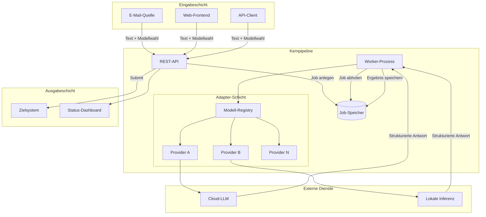
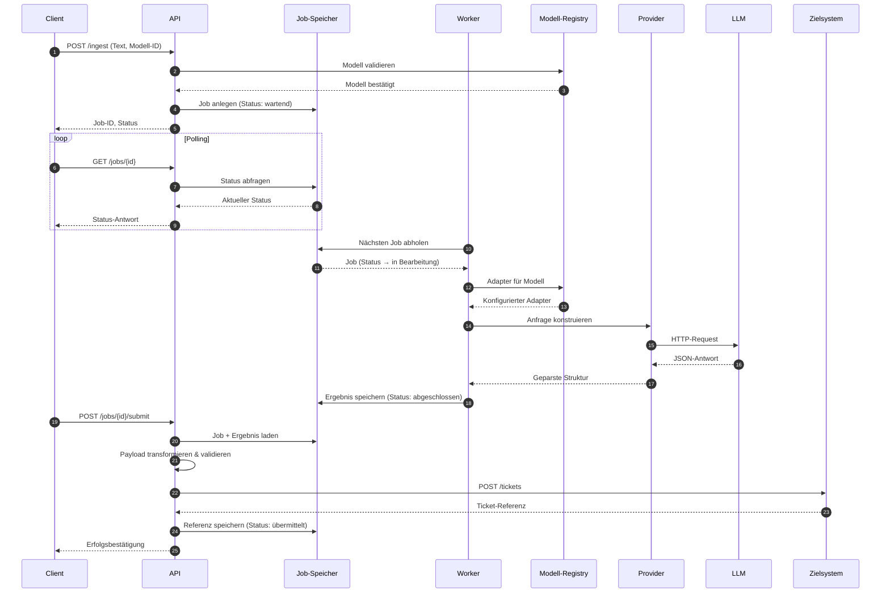
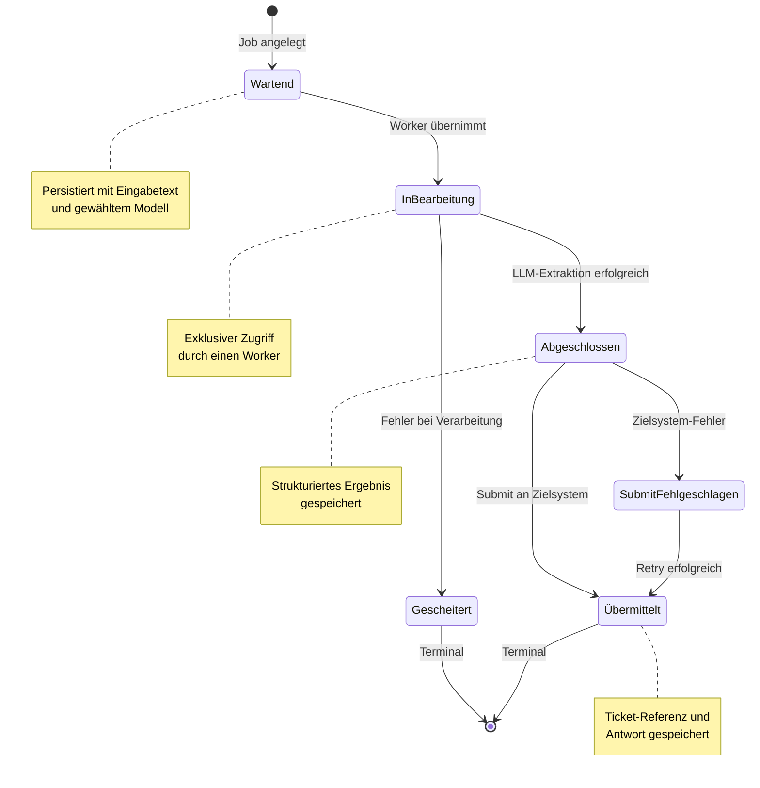
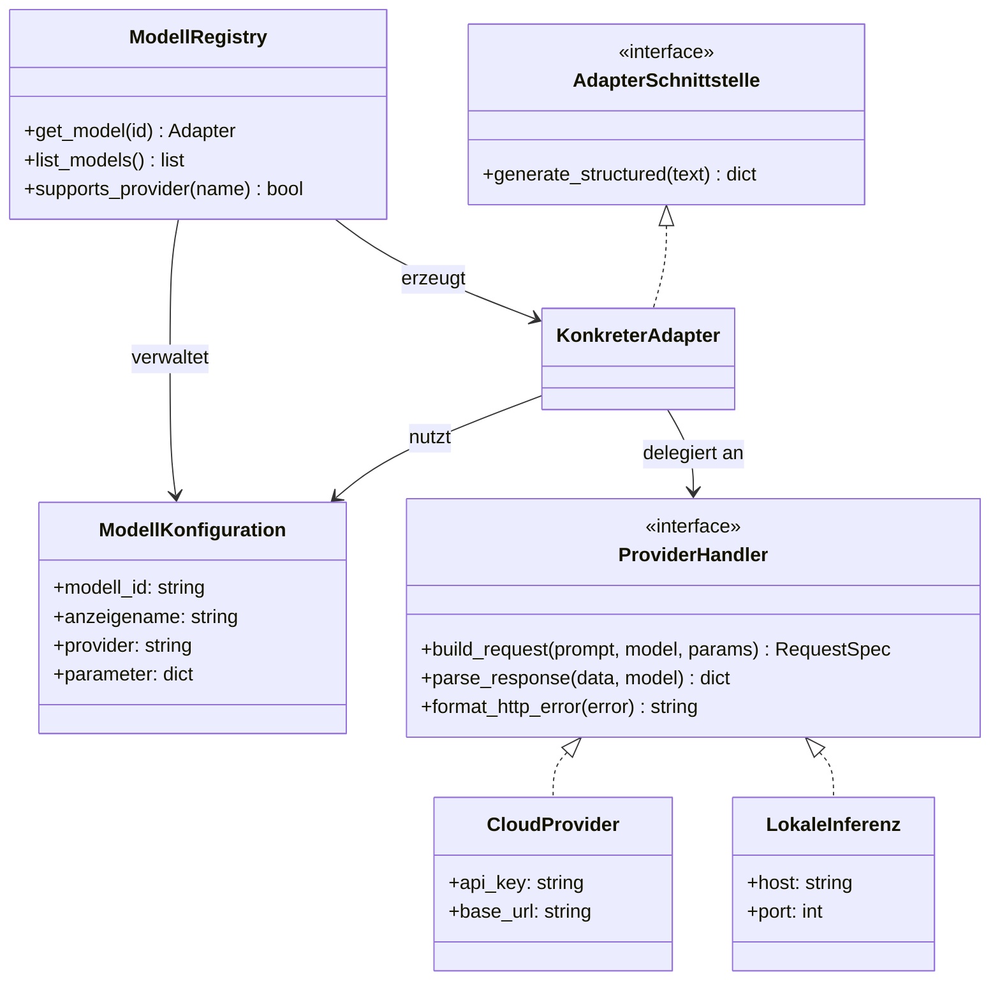
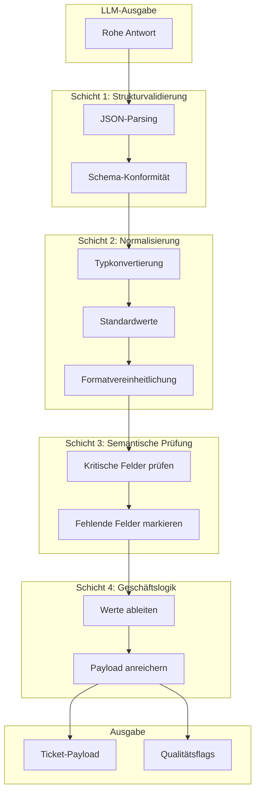
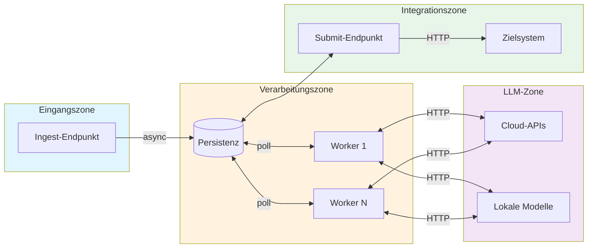

# Architekturdiagramme: Modellagnostische LLM-Pipeline

## 1. Systemübersicht (Komponentendiagramm)

---

## 2. Datenfluss (Sequenzdiagramm)

---

## 3. Job-Lebenszyklus (Zustandsdiagramm)

---

## 4. Adapter-Muster (Strukturdiagramm)

---

## 5. Validierungsschichten (Schichtendiagramm)

---

## 6. Entkopplungsarchitektur (Deployment-Sicht)

---

## Legende

| Symbol | Bedeutung |
|--------|-----------|
| Rechteck | Komponente / Prozess |
| Zylinder | Persistenter Speicher |
| Gestrichelte Linie | Asynchrone Kommunikation |
| Durchgezogene Linie | Synchrone Kommunikation |
| Subgraph | Logische Gruppierung / Zone |

---

## Verwendung

Diese Diagramme sind in Mermaid-Syntax verfasst und können gerendert werden in:
- GitHub/GitLab Markdown-Vorschau
- VS Code mit Mermaid-Extension
- Mermaid Live Editor (https://mermaid.live)
- Export als SVG/PNG für LaTeX-Einbindung
