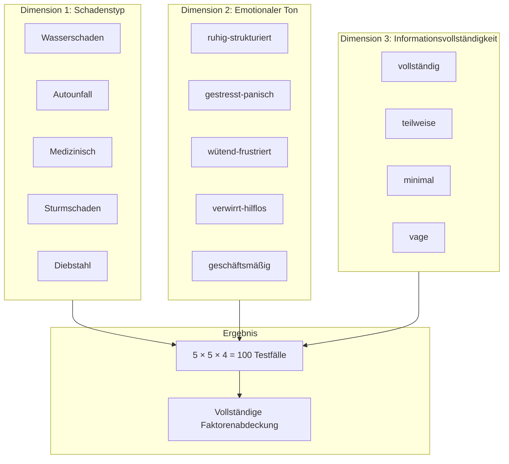
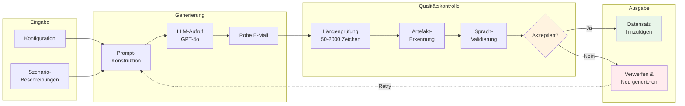
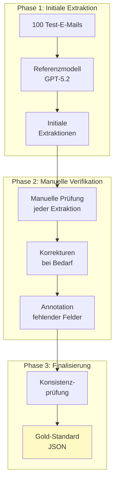
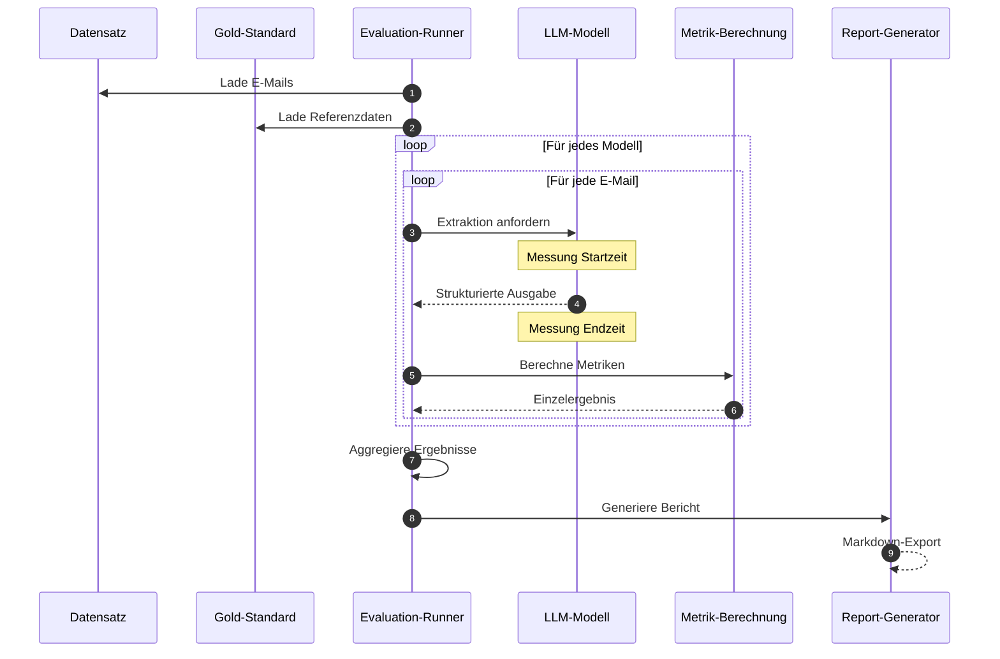
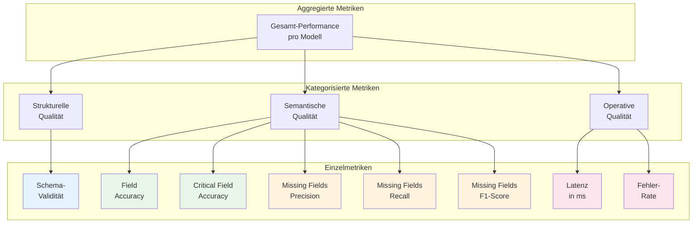
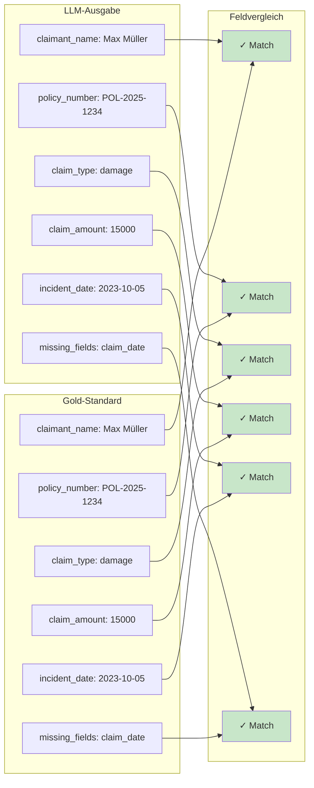
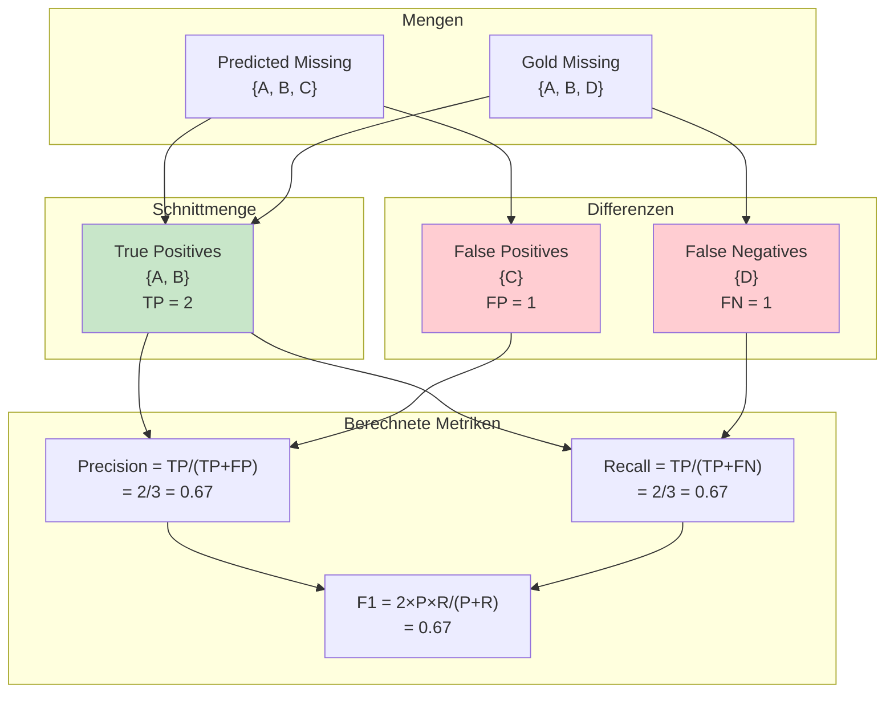
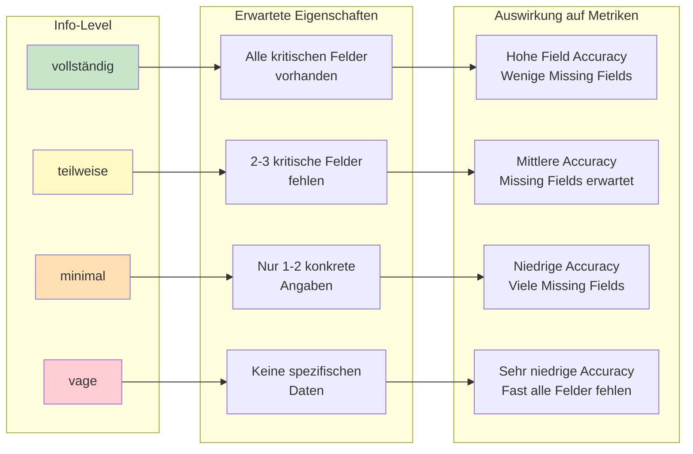
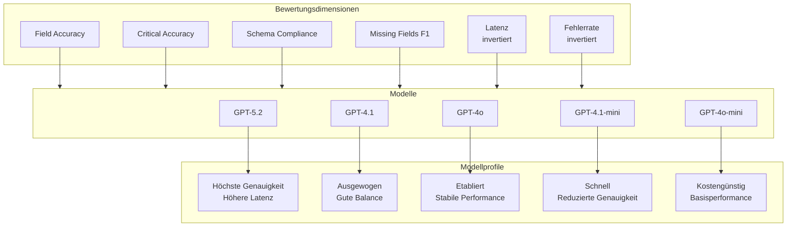

# Evaluationsdiagramme: LLM-Pipeline

## 1. Faktorielles Design der Datengenerierung

---

## 2. Datengenerierungsprozess

---

## 3. Gold-Standard Erstellung

---

## 4. Evaluationspipeline

---

## 5. Metrik-Hierarchie

---

## 6. Vergleich Predicted vs. Gold-Standard

---

## 7. Missing Fields Metriken (Mengendiagramm-Darstellung)

---

## 8. Informationsvollständigkeit und erwartete Ergebnisse

---

## 9. Modellvergleich (Radar-Darstellung konzeptionell)

---

## 10. Evaluationsablauf (Zeitliche Sicht)

```mermaid
gantt
    title Evaluationsprozess
    dateFormat X
    axisFormat %s
    
    section Vorbereitung
    Datensatz laden           :a1, 0, 1
    Gold-Standard laden       :a2, 1, 2
    Modelle initialisieren    :a3, 2, 3
    
    section Modell 1
    E-Mail 1-25               :b1, 3, 8
    E-Mail 26-50              :b2, 8, 13
    E-Mail 51-75              :b3, 13, 18
    E-Mail 76-100             :b4, 18, 23
    
    section Modell 2
    E-Mail 1-25               :c1, 23, 28
    E-Mail 26-50              :c2, 28, 33
    E-Mail 51-75              :c3, 33, 38
    E-Mail 76-100             :c4, 38, 43
    
    section Abschluss
    Metriken aggregieren      :d1, 43, 44
    Report generieren         :d2, 44, 45
```

---

## Legende

| Symbol | Bedeutung |
|--------|-----------|
| Rechteck | Prozessschritt / Komponente |
| Raute | Entscheidung |
| Zylinder | Datenspeicher |
| Grün (fill:#c8e6c9/#e8f5e9) | Erfolg / Korrekt |
| Rot (fill:#ffcdd2/#ffebee) | Fehler / Inkorrekt |
| Gelb (fill:#fff9c4/#fff3e0) | Warnung / Teilweise |
| Blau (fill:#e3f2fd) | Strukturelle Dimension |

---

## Verwendung

Diese Diagramme ergänzen das Evaluationskapitel (Kapitel 5) der Thesis und können wie folgt referenziert werden:

| Diagramm | Abschnitt | Verwendung |
|----------|-----------|------------|
| 1. Faktorielles Design | 5.2.2 | Visualisierung der Variationsdimensionen |
| 2. Datengenerierung | 5.2.3 | Prozess der E-Mail-Erzeugung |
| 3. Gold-Standard | 5.3.1 | Erstellung der Referenzdaten |
| 4. Evaluationspipeline | 5.6.1 | Gesamtablauf der Evaluation |
| 5. Metrik-Hierarchie | 5.4 | Übersicht der Metriken |
| 6. Vergleich | 5.4.2 | Feldweiser Vergleich |
| 7. Missing Fields | 5.4.4 | Precision/Recall-Berechnung |
| 8. Info-Levels | 5.2.4 | Zusammenhang Vollständigkeit/Ergebnis |
| 9. Modellvergleich | 5.5 | Modellcharakteristika |
| 10. Zeitablauf | 5.6.1 | Sequentieller Prozess |

**Rendering**: Mermaid Live Editor (https://mermaid.live) oder VS Code mit Mermaid-Extension
